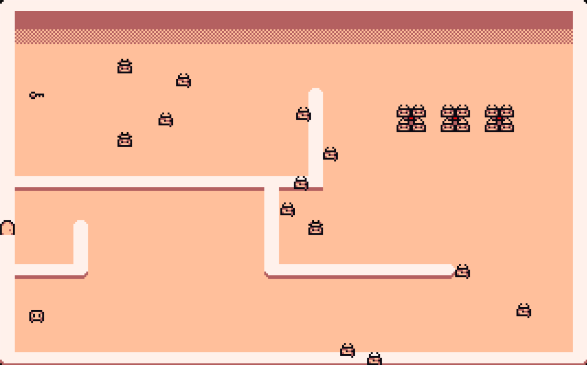
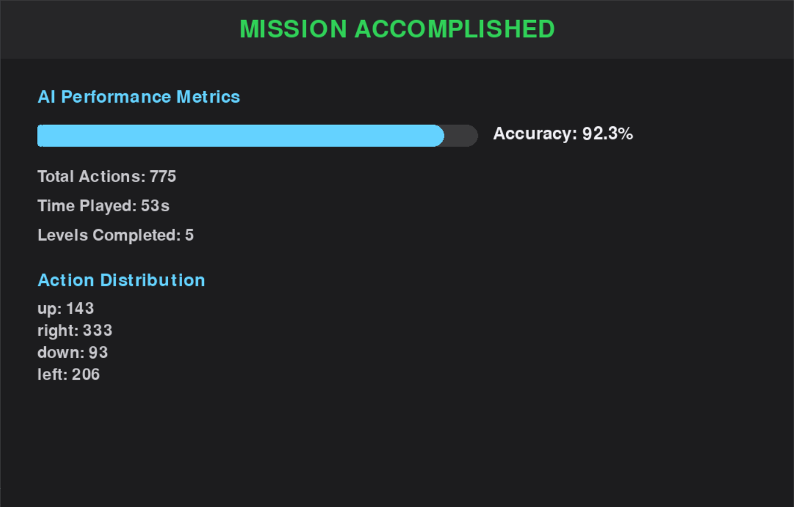

# Escape Room AI Game

Welcome to the Escape Room AI Game, a Python project where players navigate through an escape room environment with the aid of an AI agent. The AI helps players find their way to the key and escape the room while adhering to a grid-based structure for movement and interactions.

## Screenshots

### Level 1


### Level 2


### Level 3


### Results Screen


## Features

- **Grid-based Escape Room**: Players and AI agents navigate a grid-based room layout to locate the key and reach the exit.
- **Player vs. AI Roles**:
  - The player controls their character manually to explore the room.
  - The AI uses informed search techniques to guide itself to the key and exit.
- **Informed AI Search**:
  - Implements efficient algorithms for navigation and finding objectives within the room.
  - Provides a visual and interactive simulation of the AI's decision-making process.
- **Python and Pygame Integration**:
  - Developed using Python and the Pygame library for rendering the environment and managing interactions.
- **Customizable Game Environment**:
  - Modify the grid size, obstacles, and room layout through configuration.

## Project Structure

```
EscapeRoomGame/
├── main.py         # Main game logic and loop
├── ai.py           # AI agent logic and search algorithms
├── assets/         # Assets like sprites and audio files
├── images/         # Screenshots of the game
├── README.md       # Project documentation
└── requirements.txt # Python dependencies
```

## File Descriptions

- **main.py**: Handles the game loop, rendering, and player controls.
- **ai.py**: Contains the AI logic for navigating the room and finding the key using informed search algorithms.
- **assets/**: Stores all graphical and audio assets for the game.
- **images/**: Contains screenshots of the game for documentation.
- **requirements.txt**: Lists all dependencies required to run the project.

## Installation

1. **Clone the repository**:
   ```bash
   git clone https://github.com/yourusername/AI-Escaperoom.git
   cd AI-Escaperoom
   ```

2. **Install dependencies**:
   Make sure you have Python installed. Install the required Python libraries using:
   ```bash
   pip install -r requirements.txt
   ```

3. **Run the game**:
   Execute the following command in the main directory to start the game:
   ```bash
   python main.py
   ```


   

## How to Play

### Player Controls
- **Arrow Keys**: Move the player character.
- **Objective**: Locate the key and escape through the exit.

### AI Agent
- The AI navigates the environment autonomously using informed search techniques to find the key and exit.
- Press **A** to toggle between AI and manual control.

## Customization

### Room Layout
Modify the level JSON files to:
- Change grid size.
- Adjust the placement of obstacles, key, and exit.
- Customize player and AI starting positions.

### Visual Assets
Replace assets in the `assets/` folder with your own images or sprites for a personalized experience. 